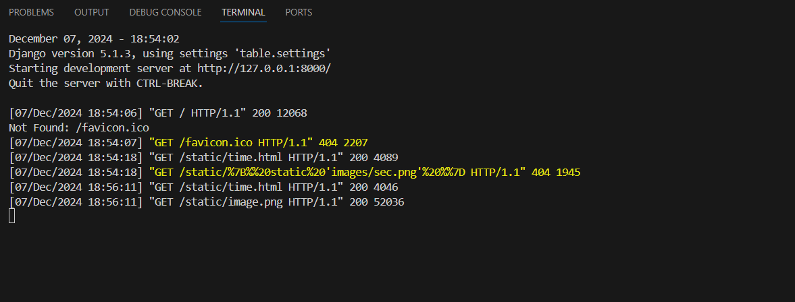
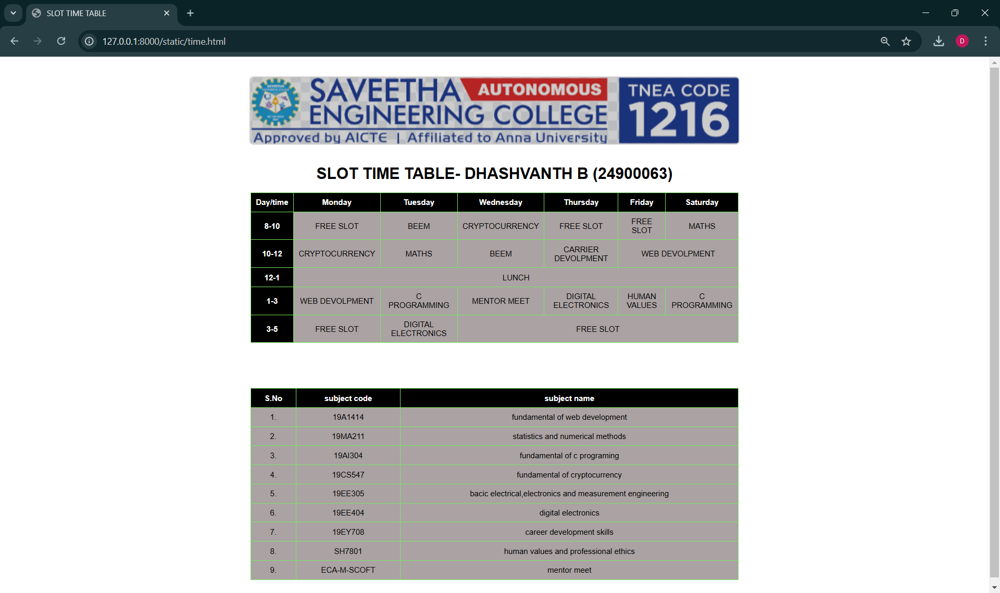

# Ex03 Time Table
# Date: 11/11/2024
# AIM
To write a html webpage page to display your slot timetable.

# ALGORITHM
## STEP 1
Create a Django-admin Interface.

## STEP 2
Create a static folder and inert HTML code.

## STEP 3
Create a simple table using `<table>` tag in html.

## STEP 4
Add header row using `<th>` tag.

## STEP 5
Add your timetable using `<td>` tag.

## STEP 6
Execute the program using runserver command.

# PROGRAM
```
<!DOCTYPE html>
<html lang="en">
<head>
    <meta charset="UTF-8">
    <meta name="viewport" content="width=device-width, initial-scale=1.0">
    <title>SLOT TIME TABLE</title>
    <style>
        body {
            display: flex;
            flex-direction: column;
            align-items: center;
            font-family: Arial, sans-serif;
            margin: 0;
            padding: 20px;
        }
        img {
            display: block;
            margin: 20px auto;
            border: 3px solid #ccc;
            border-radius: 8px;
            width: 1000px;
            height:auto;
            
        }
        h1 {
            text-align: center;
            margin-bottom: 20px;
        }
        table {
            border: 1px solid rgb(0, 9, 1);
            border-collapse: collapse;
            width: 100%;
            max-width: 1000px;
            margin-bottom: 20px;
        }
        th, td {
            border: 1px solid rgb(120, 232, 98);
            text-align: center;
            padding: 10px;
        }
        th {
            background-color: black;
            color: white;
        }
        td {
            background-color: rgb(170, 162, 163);
        }
    </style>
</head>
<body>
    
    <h1>SLOT TIME TABLE- DHASHVANTH B (24900063)</h1>
    <table>
        <tr>
        <th>Day/time</th>
        <th>Monday</th>
        <th>Tuesday</th>
        <th>Wednesday</th>
        <th>Thursday</th>
        <th>Friday</th>
        <th>Saturday</th>
        </tr>
        <tr>
        <th>8-10</th>
        <td>FREE SLOT</td>
        <td>BEEM</td>
        <td>CRYPTOCURRENCY</td>
        <td>FREE SLOT</td>
        <td>FREE SLOT</td>
        <td>MATHS</td>
        </tr>
        <tr>
           <th>10-12</th>
           <td>CRYPTOCURRENCY</td>
           <td>MATHS</td>
           <td>BEEM</td>
           <td>CARRIER DEVOLPMENT</td>
           <td colspan="2">WEB DEVOLPMENT</td>
        </tr>
        <tr>
            <th>12-1</th>
            <td colspan="6">LUNCH</td>
        </tr>
        <tr>
            <th>1-3</th>
            <td>WEB DEVOLPMENT</td>
            <td>C PROGRAMMING</td>
            <td>MENTOR MEET</td>
            <td>DIGITAL ELECTRONICS</td>
            <td>HUMAN VALUES</td>
            <td>C PROGRAMMING</td>
        </tr>
        <tr>
            <th>3-5</th>
            <td>FREE SLOT</td>
            <td>DIGITAL ELECTRONICS</td>
            <td colspan="4">FREE SLOT</td>
        </tr>
    </table>
    <br><br><br><br>
    <table style="text-align: center;">
        <tr>
            <th>S.No</th>
            <th>subject code</th>
            <th>subject name</th>
        </tr>
        <tr>
            <td>1.</td>
            <td>19A1414</td>
            <td>fundamental of web development</td>
        </tr>
        <tr>
            <td>2.</td>
            <td>19MA211</td>
            <td>statistics and numerical methods</td>
        </tr>
        <tr>
            <td>3.</td>
            <td>19AI304</td>
            <td>fundamental of c programing</td>
        </tr>
        <tr>
            <td>4.</td>
            <td>19CS547</td>
            <td>fundamental of cryptocurrency</td>
        </tr>
        <tr>
            <td>5.</td>
            <td>19EE305</td>
            <td>bacic electrical,electronics and measurement engineering</td>
        </tr>
        <tr>
            <td>6.</td>
            <td>19EE404</td>
            <td>digital electronics</td>
        </tr>
        <tr>
            <td>7.</td>
            <td>19EY708</td>
            <td>career development skills</td>
        </tr>
        <tr>
            <td>8.</td>
            <td>SH7801</td>
            <td>human values and professional ethics</td>
        </tr>
        <tr>
            <td>9.</td>
            <td>ECA-M-SCOFT</td>
            <td>mentor meet</td>
        </tr>
    </table>
</body>
</html>

```
# OUTPUT


# RESULT
The program for creating slot timetable using basic HTML tags is executed successfully.
